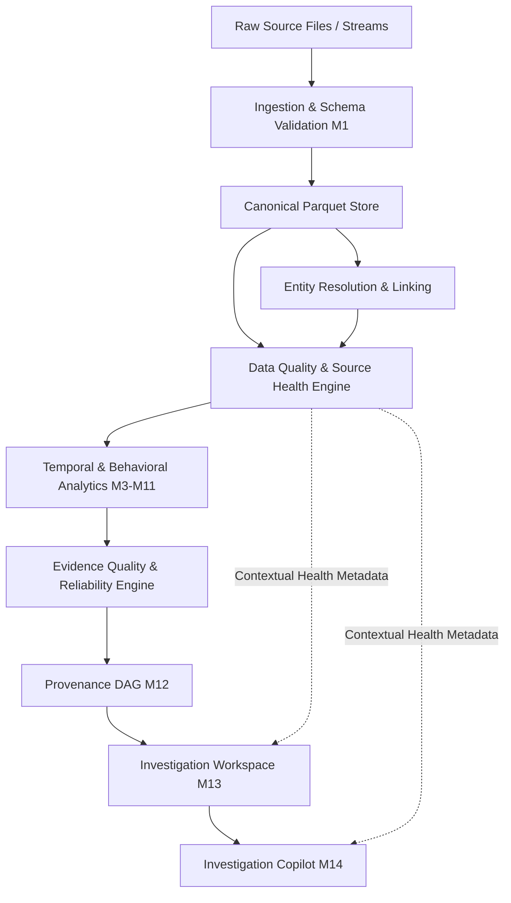

# DFAP Data Quality & Source Health Engine Specification
**Author**: Sam Roger X  
**Component**: DFAP WP1 — Data & Entity Research  
**Scope**: Production Research Data Quality, Source Health Monitoring & Case Integrity Architecture  
**Document Version**: 1.0.0-RESEARCH  
**Status**: CERTIFIED SPECIFICATION  

---

## 1. Architectural Positioning & Principles

The **Data Quality & Source Health Engine** provides deterministic, auditable governance over the physical and semantic integrity of data feeding into the Digital Footprint Fusion & Analysis Platform (DFAP).

### 1.1 Pipeline Architecture


### 1.2 Essential Scientific Separation
The platform maintains strict conceptual and operational boundaries between five distinct metrics:

1. **Data Quality & Source Health**: Evaluates whether the underlying data source is physically accessible, structurally sound, syntactically conforming, and temporally fresh.
2. **Evidence Reliability**: Evaluates the evidential sufficiency, corroboration, and contradiction state of an analytical finding derived from the evidence.
3. **Anomaly Score**: A continuous statistical measure of behavioral deviation from baseline activity.
4. **Copilot Confidence**: The epistemic certainty of an investigative response given grounded evidence and contradiction severity.
5. **Statistical Probability**: Calibrated empirical frequencies or posterior distributions.

> [!IMPORTANT]
> **Non-Calibration Disclaimer**:
> All thresholds utilized in the Data Quality & Source Health Engine are deterministic engineering boundaries defined by formal operational rules. They are **not** empirical posterior probabilities, bayesian likelihoods, or statistical hypothesis test $p$-values. An observed 95% volume decrease does not mathematically "prove" adversary evasion; it deterministic triggers a `CRITICAL` volume health rule requiring investigator audit.

### 1.3 Explicit Schema Evaluation Modes & Empty Source Semantics

#### Schema Evaluation Modes (`SchemaEvaluationMode`)
To eliminate conflation between external raw data feeds and normalized platform tables, the engine operates in two explicit modes:
- `RAW_SOURCE`: Validates schema structure against authoritative `manifest.json` expectations (`required_columns`). Does not enforce internal canonical vocabularies (e.g. `event_type`, `source_domain`). For raw datasets lacking native timestamps (e.g. UNSW-NB15, where sequence offsets are managed by M1 ingestion adapters), timestamp validity evaluates to `NOT_APPLICABLE`. Supports unix epoch numeric timestamps as well as standard ISO strings.
- `CANONICAL_SOURCE`: Validates schema structure against strict post-M1 canonical contracts (`event_id`, `timestamp`, `actor_id`, `event_type`, `source_domain`, `attributes`, `sha256_hash`) and frozen vocabularies (`ALLOWED_EVENT_TYPES`, `ALLOWED_SOURCE_DOMAINS`).

#### Empty Source Classification (`EmptySourceClassification`)
Empty data sources are deterministically classified to avoid ambiguous or falsely healthy interpretations:
- `EMPTY_VALID_SOURCE`: 0 records observed, and authoritative baseline explicitly indicates 0 records expected $\rightarrow$ `HEALTHY`.
- `UNAVAILABLE_SOURCE`: Physical source file is missing from disk, unreadable, or 0 bytes $\rightarrow$ `UNAVAILABLE`.
- `MISSING_DATA`: 0 records observed, but authoritative baseline indicates records were expected ($V_{base} > 0$) $\rightarrow$ `CRITICAL`.
- `UNKNOWN_REFERENCE`: 0 records observed, but no authoritative baseline is available $\rightarrow$ `UNKNOWN`.

---

## 2. The 12 Formal Dimensions of Data Quality

Every data source and case ecosystem is systematically evaluated across twelve independent dimensions.

| # | Dimension Name | Evaluation Target | Primary Metric | Deterministic Quality Rule |
|---|---|---|---|---|
| 1 | `schema_validity` | Column structure & frozen vocabulary | Missing columns, invalid domains/types | Required columns present; unrec domain/type rate $\le 0.10$ |
| 2 | `completeness` | Nulls and blanks in critical fields | Missingness rate | $r \le 0.05$ HEALTHY; $0.05 < r \le 0.20$ DEGRADED; $r > 0.20$ CRITICAL |
| 3 | `timestamp_validity` | Temporal format & bounds | Invalid timestamp rate | $r \le 0.02$ HEALTHY; $0.02 < r \le 0.10$ DEGRADED; $r > 0.10$ CRITICAL |
| 4 | `identifier_validity` | Actor/target string syntax & sentinel checks | Placeholder identifier rate | $r \le 0.02$ HEALTHY; $0.02 < r \le 0.10$ DEGRADED; $r > 0.10$ CRITICAL |
| 5 | `duplicate_rate` | Primary keys and payload uniqueness | Duplicate event rate | $r \le 0.01$ HEALTHY; $0.01 < r \le 0.15$ DEGRADED; $r > 0.15$ CRITICAL |
| 6 | `referential_consistency` | Foreign keys between layers | Broken reference rate | $r \le 0.01$ HEALTHY; $0.01 < r \le 0.10$ DEGRADED; $r > 0.10$ CRITICAL |
| 7 | `provenance_completeness`| Manifest SHA-256 & DAG lineage root | Cryptographic hash match | Manifest digest match: HEALTHY; mismatch: CRITICAL; uncataloged: DEGRADED |
| 8 | `freshness` | Elapsed time from latest event to reference | Elapsed seconds $\Delta t$ | $\Delta t \le 30	ext{d}$ HEALTHY; $30	ext{d} < \Delta t \le 180	ext{d}$ DEGRADED; $> 180	ext{d}$ CRITICAL; no clock: UNKNOWN |
| 9 | `volume_health` | Record count vs authoritative baseline | Volume ratio $V_{	ext{obs}} / V_{	ext{base}}$ | $[0.80, 1.50]$ HEALTHY; $[0.20, 0.80) \cup (1.50, 3.00]$ DEGRADED; $<0.20 ee >3.00$ CRITICAL; no baseline: UNKNOWN |
| 10| `domain_distribution` | Conformance to expected domain mix | Missing expected domains | All expected present: HEALTHY; unexpected domain: DEGRADED; expected domain 0 count: CRITICAL |
| 11| `rejection_health` | M1 RowValidationReport accountability | Invariant & rejection rate | Invariant $R = A + J$; rate $\le 0.05$ HEALTHY; $0.05 < r \le 0.20$ DEGRADED; $r > 0.20$ CRITICAL |
| 12| `cross_field_consistency`| Semantic agreement across field pairs | Contradiction rate | $r \le 0.02$ HEALTHY; $0.02 < r \le 0.10$ DEGRADED; $r > 0.10$ CRITICAL |

---

## 3. Strict Handling of Reference Baselines

To maintain research integrity and prevent false precision, dimensions requiring external reference information strictly return `UNKNOWN` when authoritative baselines are absent. Baselines are **never fabricated or assumed**.

1. **Volume Health**:
   - Requires `reference_baseline_count` from `data/sources/manifest.json` or explicit ingestion configuration.
   - If missing: `status = UNKNOWN`.
2. **Freshness**:
   - Requires an explicit reference clock timestamp (e.g., query time, pipeline ingestion time).
   - If missing: `status = UNKNOWN`.
3. **Domain Distribution**:
   - Requires registered reference domain expectations from `DatasetRegistry` or manifest.
   - If missing: `status = UNKNOWN`.
4. **Rejection Health**:
   - Requires an official M1 `RowValidationReport`.
   - If missing: `status = NOT_APPLICABLE`.

---

## 4. Invariant Preservation in M1 Rejection Accountability

The engine strictly verifies the conservation invariant in M1 row accountability:
$$	ext{received\_rows} = 	ext{accepted\_rows} + 	ext{rejected\_rows}$$
If $	ext{received} 
e 	ext{accepted} + 	ext{rejected}$, the engine immediately flags `rejection_health = CRITICAL` due to an accountability breach in upstream data ingestion.

---

## 5. Threshold Sensitivity & Boundary Analysis

The table below documents boundary state transitions at $T - \epsilon$, $T$, and $T + \epsilon$ ($\epsilon = 10^{-4}$):

| Dimension / Metric | Boundary Point $T$ | Metric Value $T - \epsilon$ | Status at $T - \epsilon$ | Metric Value $T$ | Status at $T$ | Metric Value $T + \epsilon$ | Status at $T + \epsilon$ |
|---|---|---|---|---|---|---|---|
| Completeness | 0.05 (Degraded) | 0.0499 | HEALTHY | 0.0500 | HEALTHY | 0.0501 | DEGRADED |
| Completeness | 0.20 (Critical) | 0.1999 | DEGRADED | 0.2000 | DEGRADED | 0.2001 | CRITICAL |
| Timestamp Validity | 0.02 (Degraded) | 0.0199 | HEALTHY | 0.0200 | HEALTHY | 0.0201 | DEGRADED |
| Timestamp Validity | 0.10 (Critical) | 0.0999 | DEGRADED | 0.1000 | DEGRADED | 0.1001 | CRITICAL |
| Identifier Validity | 0.02 (Degraded) | 0.0199 | HEALTHY | 0.0200 | HEALTHY | 0.0201 | DEGRADED |
| Identifier Validity | 0.10 (Critical) | 0.0999 | DEGRADED | 0.1000 | DEGRADED | 0.1001 | CRITICAL |
| Duplicate Rate | 0.01 (Degraded) | 0.0099 | HEALTHY | 0.0100 | HEALTHY | 0.0101 | DEGRADED |
| Duplicate Rate | 0.15 (Critical) | 0.1499 | DEGRADED | 0.1500 | DEGRADED | 0.1501 | CRITICAL |
| Referential Consistency | 0.01 (Degraded) | 0.0099 | HEALTHY | 0.0100 | HEALTHY | 0.0101 | DEGRADED |
| Referential Consistency | 0.10 (Critical) | 0.0999 | DEGRADED | 0.1000 | DEGRADED | 0.1001 | CRITICAL |
| Rejection Rate | 0.05 (Degraded) | 0.0499 | HEALTHY | 0.0500 | HEALTHY | 0.0501 | DEGRADED |
| Rejection Rate | 0.20 (Critical) | 0.1999 | DEGRADED | 0.2000 | DEGRADED | 0.2001 | CRITICAL |
| Volume Ratio (Collapse) | 0.20 (Critical) | 0.1999 | CRITICAL | 0.2000 | DEGRADED | 0.2001 | DEGRADED |
| Volume Ratio (Low Degr) | 0.80 (Degraded) | 0.7999 | DEGRADED | 0.8000 | HEALTHY | 0.8001 | HEALTHY |
| Volume Ratio (High Degr)| 1.50 (Degraded) | 1.4999 | HEALTHY | 1.5000 | HEALTHY | 1.5001 | DEGRADED |
| Volume Ratio (Spike) | 3.00 (Critical) | 2.9999 | DEGRADED | 3.0000 | DEGRADED | 3.0001 | CRITICAL |

---

## 6. Deterministic Overall Health Aggregation

### 6.1 Source-Level Composition
Given the set of evaluated dimensions $D = \{d_1, d_2, \dots, d_{12}\}$:
- **`CRITICAL`**: If $\exists d \in D$ such that $	ext{status}(d) = 	ext{CRITICAL}$.
- **`UNAVAILABLE`**: If physical source file does not exist, is unreadable, or contains 0 bytes.
- **`DEGRADED`**: If $\exists d \in D$ such that $	ext{status}(d) = 	ext{DEGRADED}$, and $orall d \in D, 	ext{status}(d) 
e 	ext{CRITICAL}$.
- **`HEALTHY`**: If $orall d \in D, 	ext{status}(d) \in \{	ext{HEALTHY}, 	ext{NOT\_APPLICABLE}, 	ext{UNKNOWN}\}$ (with at least one `HEALTHY` dimension).
- **`UNKNOWN`**: If all core evaluable dimensions are `UNKNOWN` due to absent baselines.

### 6.2 Case-Level Composition
Across all data sources $S = \{s_1, s_2, \dots, s_k\}$ utilized by evidence attached to findings in case $C$:
- **`CRITICAL`**: If $\exists s \in S$ such that $	ext{status}(s) = 	ext{CRITICAL}$.
- **`UNAVAILABLE`**: If $\exists s \in S$ such that $	ext{status}(s) = 	ext{UNAVAILABLE}$.
- **`DEGRADED`**: If $\exists s \in S$ such that $	ext{status}(s) = 	ext{DEGRADED}$, and no source is `CRITICAL` or `UNAVAILABLE`.
- **`HEALTHY`**: If $orall s \in S, 	ext{status}(s) = 	ext{HEALTHY}$.
- **`UNKNOWN`**: If no source records exist or all sources are `UNKNOWN`.

---

## 7. M14 Copilot & CLI Integration

### 7.1 Copilot Q&A
Investigative queries querying data quality or source health (e.g., *"Is the underlying source healthy?"*, *"What is the data quality for case X?"*) are routed deterministically to `DataQualitySourceHealthEngine`.
The response payload incorporates:
- `overall_status`: Categorical state (`HEALTHY`, `DEGRADED`, `CRITICAL`, `UNAVAILABLE`, `UNKNOWN`).
- `data_quality` / `source_health`: Full structured JSON breakdown of all 12 dimensions.
- `limitations`: Standard non-calibration disclaimers.
- `suggested_next_actions`: Remediation actions tailored to observed defects.

### 7.2 WP4 Interactive CLI
Operators can directly inspect source health and case data quality via dedicated subcommands:
```bash
copilot source-health <source_id>
copilot data-quality <case_id>
```
