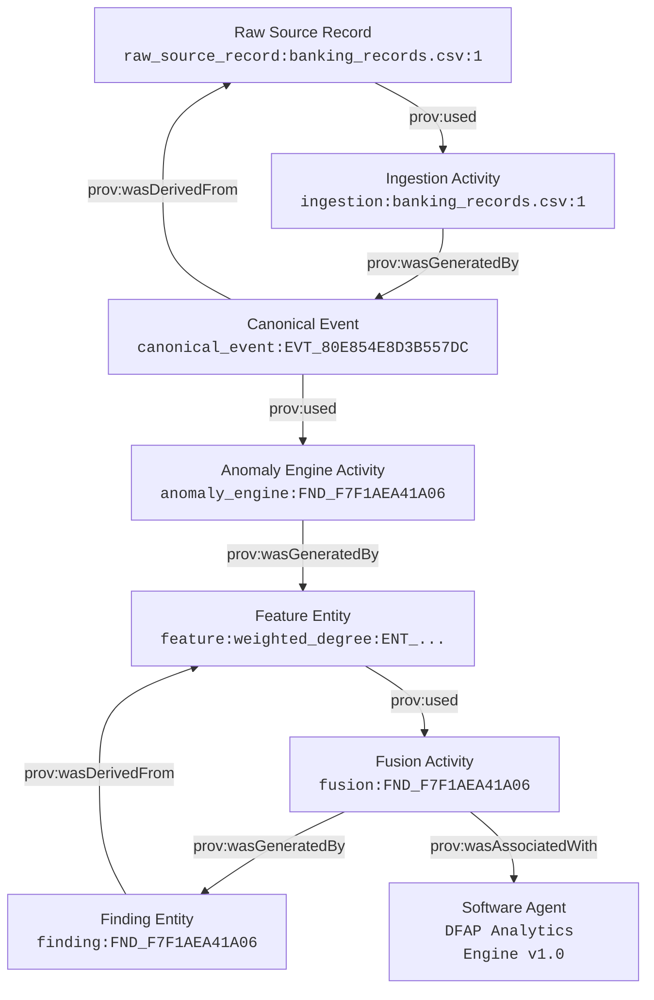

# DFAP Member 4 (WP4) — W3C PROV-O Formal Provenance Specification

**Author**: Sam Roger X  
**Component**: DFAP WP4 — Evidence & Provenance Engine (M12)  
**Date**: September 2026 (Release Candidate 4)  

---

## 1. W3C PROV-O Mapping Standard

DFAP implements a fully compliant, deterministic representation of the W3C PROV-O (Provenance Ontology) standard across all digital footprint artifacts.

### 1.1 Namespaces & Deterministic URIs
- **PROV Namespace**: `http://www.w3.org/ns/prov#`
- **DFAP Namespace**: `urn:dfap:`

| Concept Category | DFAP Domain Object | PROV-O Mapping | Deterministic URI Pattern |
|---|---|---|---|
| **Entity** | Raw Ingested CSV Row | `prov:Entity` | `urn:dfap:entity:raw_source_record:<source_file>:<row_index>` |
| **Entity** | Canonical Normalized Event | `prov:Entity` | `urn:dfap:entity:canonical_event:<event_id>` |
| **Entity** | Analytical Feature | `prov:Entity` | `urn:dfap:entity:feature:<feature_name>:<entity_id>` |
| **Entity** | Analytical Lead / Finding | `prov:Entity` | `urn:dfap:entity:finding:<finding_id>` |
| **Activity** | Data Ingestion & Validation | `prov:Activity` | `urn:dfap:activity:ingestion:<source_file>:<row_index>` |
| **Activity** | Anomaly Engine & Baselines | `prov:Activity` | `urn:dfap:activity:anomaly_engine:<finding_id>` |
| **Activity** | Cross-Domain Fusion (M11) | `prov:Activity` | `urn:dfap:activity:fusion:<finding_id>` |
| **Agent** | DFAP Analytics Engine | `prov:SoftwareAgent` | `urn:dfap:agent:software:DFAP_Analytics_Engine_v1` |

---

## 2. Standard PROV-O Predicates & Lifecycle Traversal

---

## 3. Feature Lineage & Evidence Association Semantics

In the frozen Member 3 contract (`output/m3/findings/findings.parquet`), `evidence_refs` are defined at the **finding level** representing the set of canonical event cryptographic hashes that justify the overall anomaly conclusion.

- **Contract Characteristic / Limitation**: The upstream Member 3 schema does not provide a separate per-feature `evidence_refs` mapping within `graph_refs`.
- **Lineage Rule**: Work Package 4 resolves each feature value directly from its frozen feature store (`graph_features.parquet`, `telecom_features.parquet`, `financial_features.parquet`, `social_features.parquet`) and associates the finding-level `evidence_refs` to each resolved feature record. This guarantees deterministic end-to-end traceability while preserving the exact semantics of the upstream contract without inventing synthetic feature-level provenance.

---

## 4. Legal Chain of Custody Disclaimer

While DFAP implements the formal W3C PROV-O graph representation, PROV-O compliance alone does not constitute a legally certified chain of custody under evidentiary rules. DFAP achieves forensic integrity through **row-level cryptographic SHA-256 provenance ledgers**, immutable Parquet storage contracts, and strict read-only audit logging.
